# Login Page
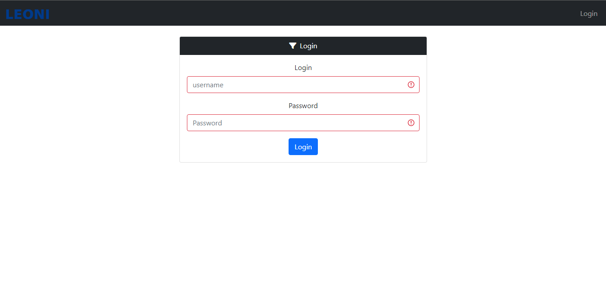

## Forcer l'utilisateur à changer le mot de passe lors de sa première connexion
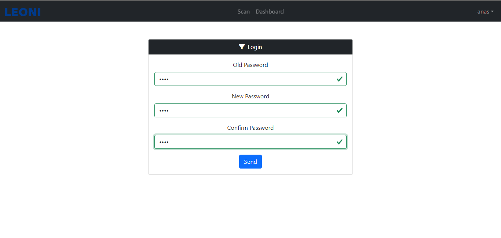

# ADMIN Pages
## add new user
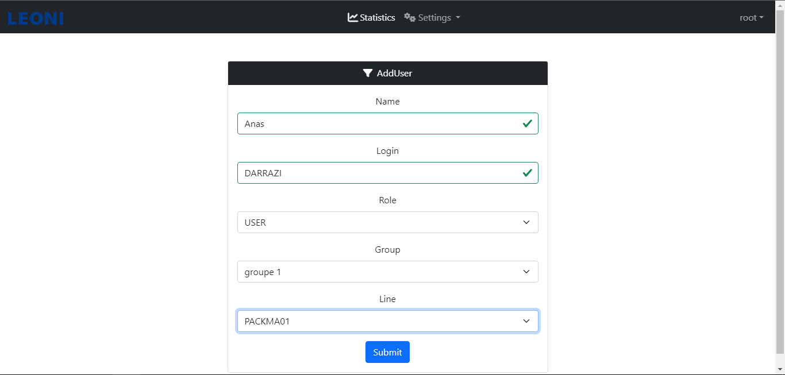

## list users
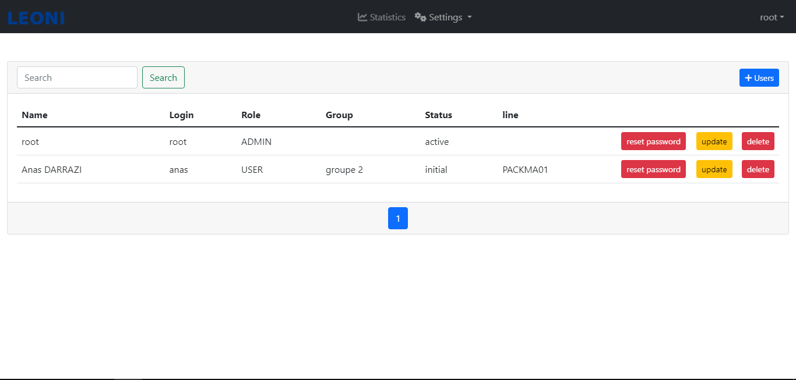

## list groupes
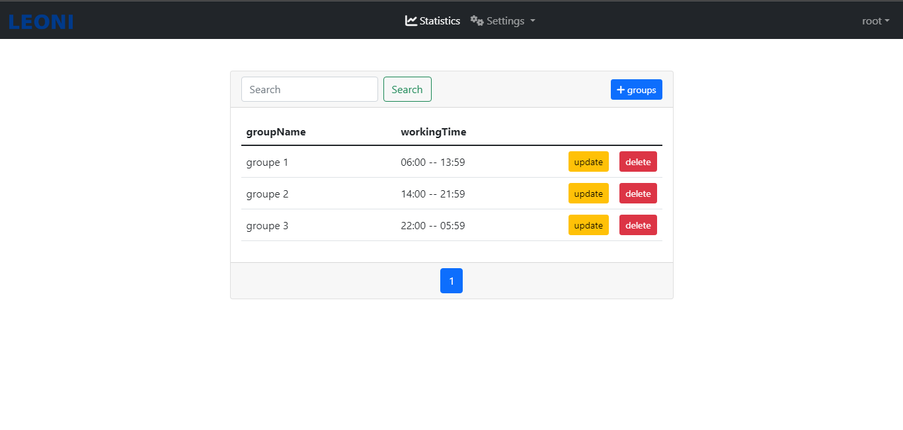

## list des cables scannée par les ouvriers
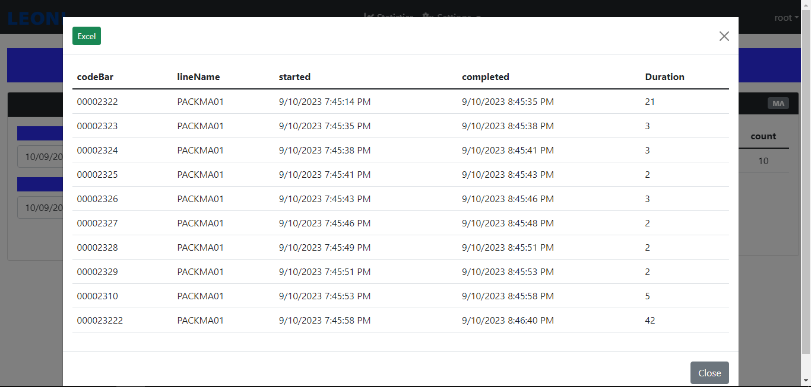
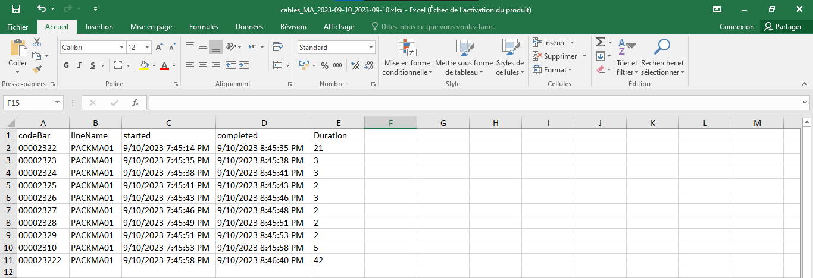

# USER Pages
## scanner le code bar de produit
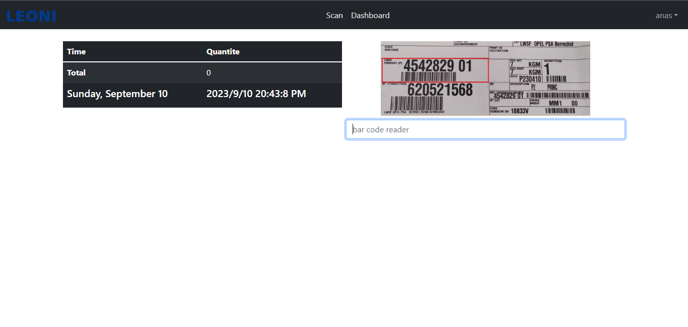

## scanner le code bar de l'emballage
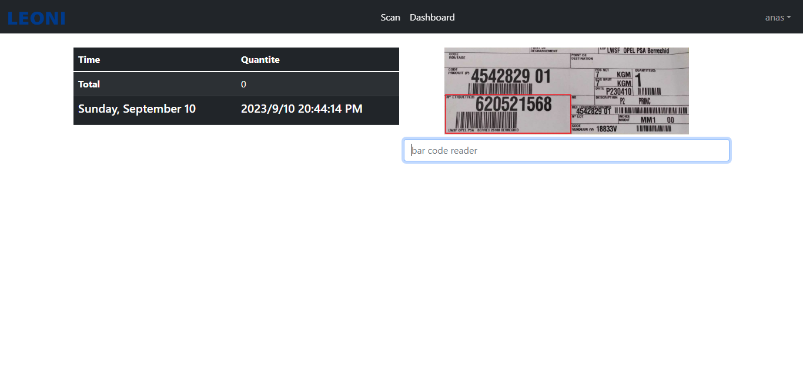

## scanner le code bar de la quantité
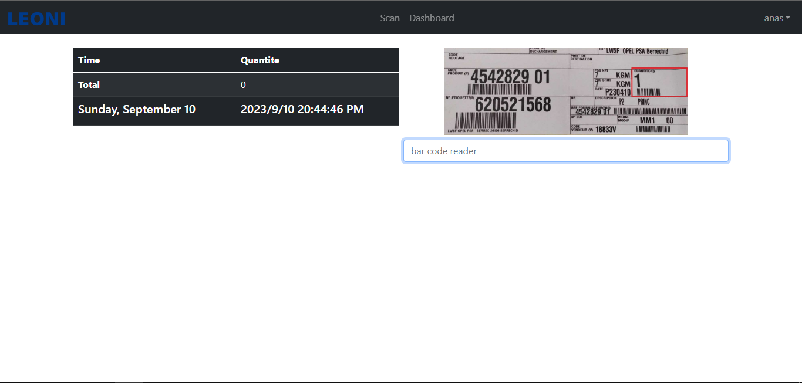

## scanner le code bar des cables
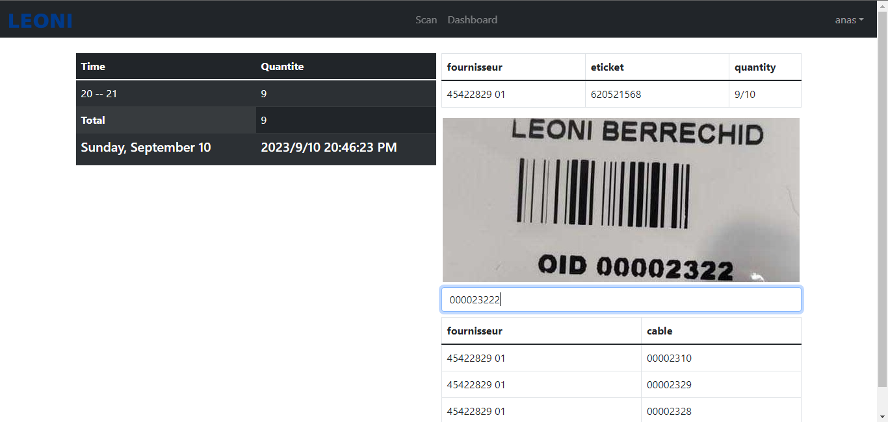

## total des cable a été scanné par l'utilisateur courant
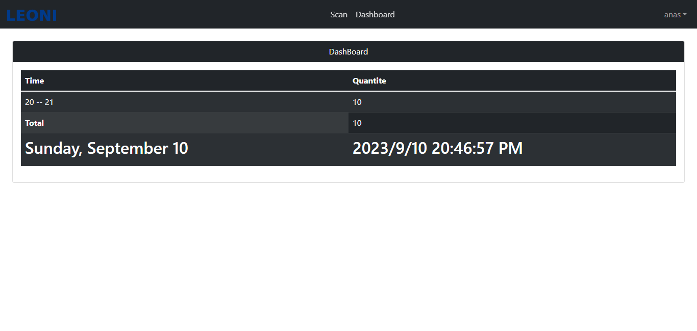
